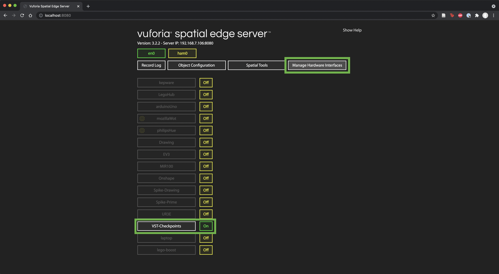
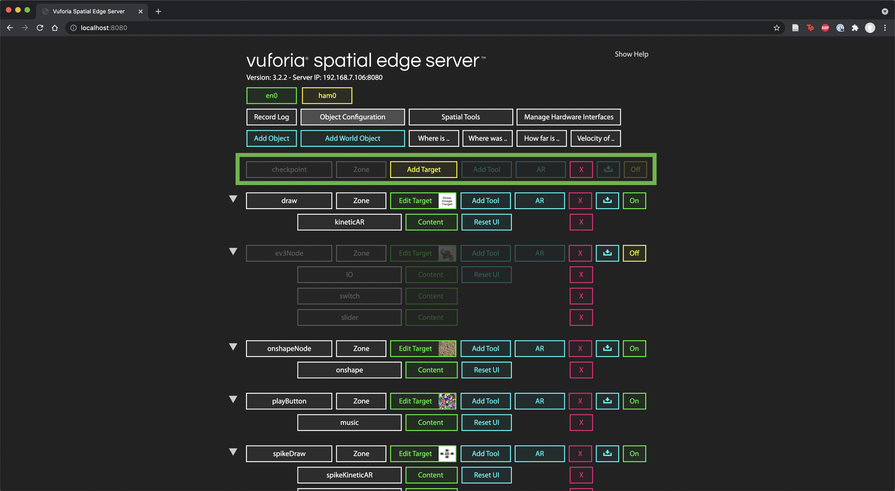

# **Installation**

- If you have not already installed the Vuforia Spatial Toolbox, go to [github.com/ptcrealitylab/vuforia-spatial-edge-server](github.com/ptcrealitylab/vuforia-spatial-edge-server) and follow the instructions in their README.md to get started.
- Additionally, if you have not installed the robotic addon, go to [github.com/ptcrealitylab/vuforia-spatial-robotic-addon](github.com/ptcrealitylab/vuforia-spatial-robotic-addon) and follow the instructions in their README.md.
- Once you have the Vuforia Spatial Toolbox installed, in Terminal (or Command Prompt) naviagte to /vuforia-spatial-edge-server/addons/vuforia-spatial-robotic-addon/interfaces.
- Clone this repository into the interfaces folder by running `git clone https://github.com/PTC-Education/VST-Checkpoints.git`

# **Usage**

- This addon is intended to connect Onshape, Vuforia Spatial Toolbox, and a robot through the usage of the motion tool.
- If you have a robot with inverse kinematics that you wish to use with this interface, please open index.js and see lines 325-331 for more information.
    - To summarize, on line 325, you will want to add your inverse kinematics and tell index.js that the robot is currently in motion by setting inMotion to true.
    - You will then want to elsewhere in the index.js file have a function that checks the position of the robot to see if it has reached the position you sent it. Once that happens, you will want to set inMotion to false as well as deactivating the checkpoint by copy and pasting the line on 331 into your function.
    - You may also need other lines of code to initialize a connection between the Vuforia Spatial Edge Server and your robot or retrieve other information.
- To start the Vuforia Spatial Toolbox server, in Terminal navigate to /vuforia-spatial-edge-server. Once there, run `node server` to start the server.
    - If you've added your own inverse kinematics you may have errors appear at this step that you will have to resolve before proceeding.
- Once the server is running, go to localhost:8080 in a web browser.
- Go to Manage Hardware Interfaces and turn on the interface labelled "VST-Checkpoints".

- Restart the server by going to Terminal, entering ctrl+c, and running `node server` again.
- Return to localhost:8080. You should see a new object named "checkpoint" in the Object Configuration tab. You will need to attach an Image Target to this object. Follow the instructions at [spatialtoolbox.vuforia.com/docs/tutorials/attaching-targets-to-objects](spatialtoolbox.vuforia.com/docs/tutorials/attaching-targets-to-objects) to do this.

- Once you have added an image target, go to Manage Hardware Interfaces and click the cog wheel next to the VST-Checkpoints interface, which should be turned on.
    - If you do not see a cog wheel, try restarting the server.

- Edit these settings to fit your Onshape assembly and robot preferences. All units are in millimeters.
- Restart the server to apply the setting changes.
- Once the server starts up, you can now open the app on your phone to start using the motion tool!
- Point your phone at the image target to load the interface. **Note:** The interface takes a few seconds to load. Wait for the buttons in the top left corner to be the same color before placing a checkpoint.
- Place checkpoints by tapping the screen at the location you want to add a checkpoint. You can drag the checkpoint to reposition it within the ground plane. You can get more options to move the checkpoint around, such as altering the height, by holding the checkpoint.
- As you place checkpoints, they should appear in the specified Onshape assembly. **Note:** Adding checkpoints to the Onshape assembly takes a second or two. If you place checkpoints very quickly, the Onshape assembly might miss a checkpoint's position.
- Editing checkpoints in the Spatial Toolbox will also edit the specified checkpoint's position in Onshape.
- You can also control the position of checkpoints in Spatial Toolbox through Onshape by activating the "getOnshape" node on the image target. If you are unfamiliar with how to do that, see [spatialtoolbox.vuforia.com/docs/use/using-the-app](spatialtoolbox.vuforia.com/docs/use/using-the-app) or [www.youtube.com/watch?v=3wkmBDgpb34](www.youtube.com/watch?v=3wkmBDgpb34) for an explanation.
- When the getOnshape node is activated, the Onshape checkpoint positions will be applied to the Spatial Toolbox checkpoints. **Note:** You will need to re-activate the getOnshape node to update Spatial Toolbox positions if they change in Onshape.
- If you have an inverse kinematics applied to the interface, you should be able to move the robot to each checkpoint by activating the first checkpoint in the series, similarly to how we activated the getOnshape node.
- If you want to remove all the checkpoints from both the Spatial Toolbox and Onshape, tap the Trash Can button in the bottom left of your screen.

# **Future Work**

- Currently, the height going from Onshape to Spatial Toolbox is not entirely accurate. This is located in /tools/motion/js/kineticARView.js on line 298. **Note:** When changing files within the tools/motion/js folder, you need to go to that folder in Terminal and run `npm run watch` for the changes to take effect.
- Currently, the checkpoints do not have permanent storage. When closing the Spatial Toolbox app, you lose all the checkpoint information that you had previously. By using the Onshape positions as a permanent storage, we should be able to retrieve the position from each checkpoint part and create those checkpoints in the Spatial Toolbox.
- Currently, the inverse kinematics requires editing the index.js file. It would be simpler if there was a separate file inverseKinematics.js that handled the inverse kinematics for the robot and was simply referenced in index.js. This would mean that different robots would only have to change parameters within inverseKinematics.js.
- Currently, the Onshape API is called twice per checkpoint made. One call is to add the part to the assembly, while the second is to move that checkpoint to the position specified in the Spatial Toolbox. There is an API call in Onshape that can do both of these with one call, namely "Create and transform assembly instances" at /assemblies/d/:did/w/:wid/e/:eid/transformedinstances. This would decrease the time taken to add each checkpoint to the Onshape document, but would require reformatting the requests.
